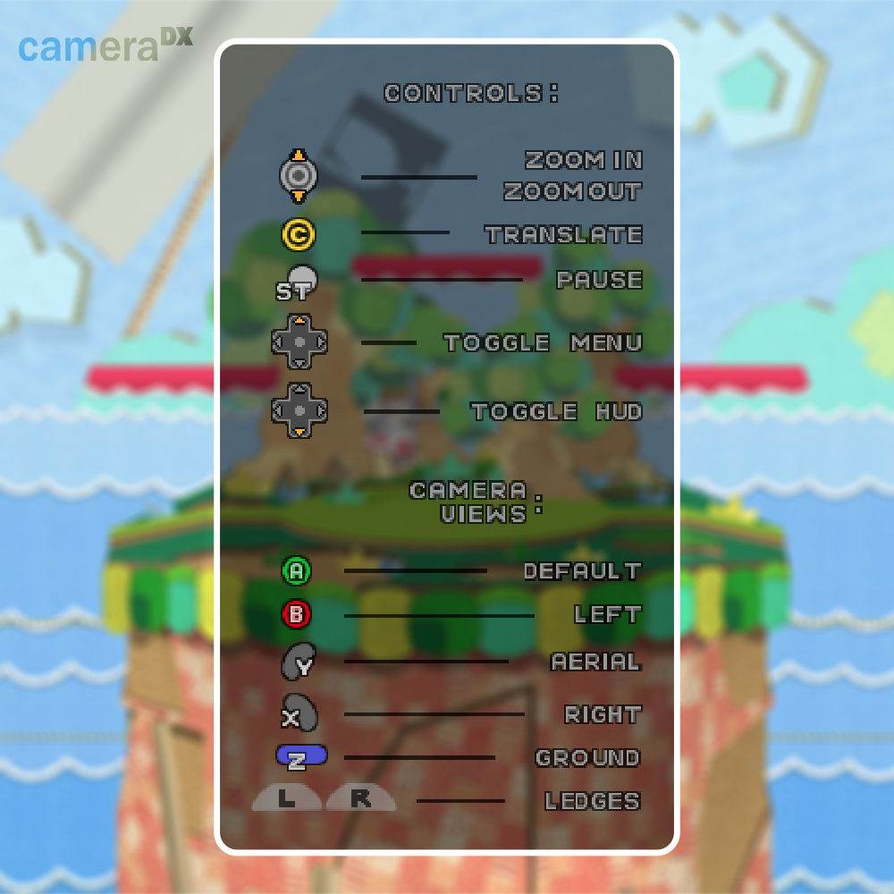

# CameraDX

This tool adds new functionality to Melee's camera while spectating games.
## Controls

## Installation

Place `cdx_hud.usd` into

`C:\Users\*user*\AppData\Roaming\Slippi Launcher\playback\Sys\GameFiles\GALE01`

Copy paste the code from `CameraDX Code.txt` into Slippi Launchers gecko code manager:

`Settings -> Playback -> Manage Gecko Codes -> Add`
